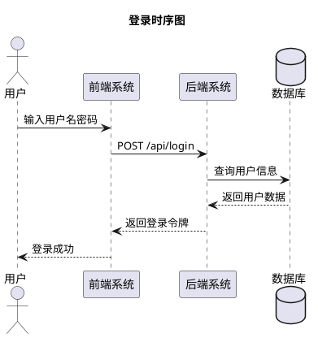
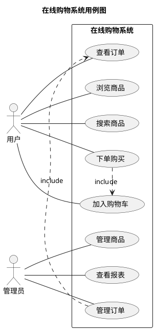
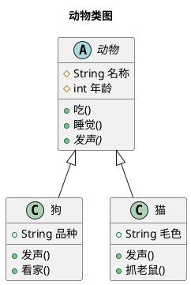
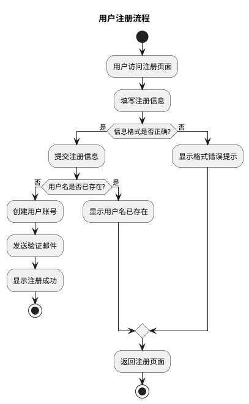
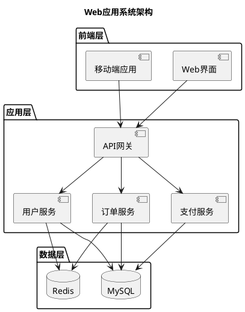
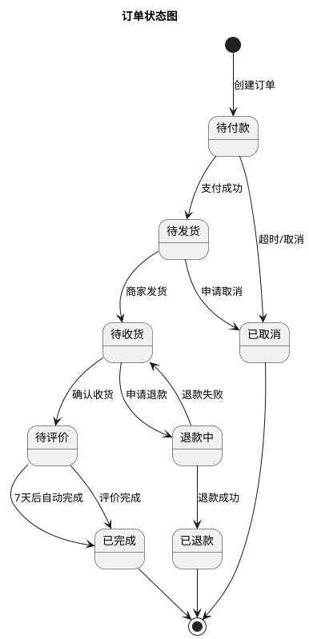
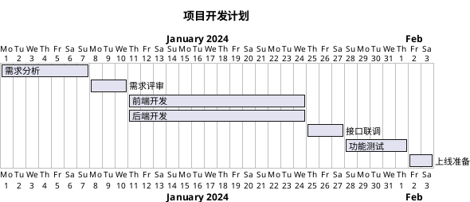
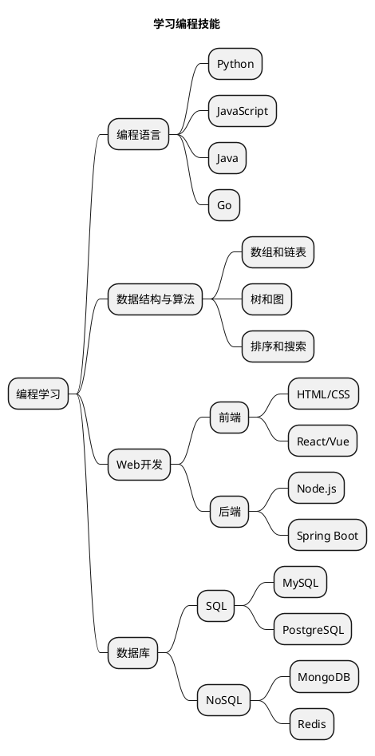

# 使用 PlantUML 绘制 UML 模型图
> Obsidian 可以通过下载 PlantUML 插件实现 UML 图形的创建和预览，结合AI工具可以快速编辑软件工程中的文档图片。
### 时序图

```plantuml
@startuml
title 登录时序图

actor 用户
participant "前端系统" as Frontend
participant "后端系统" as Backend
database "数据库" as DB

用户 -> Frontend: 输入用户名密码
Frontend -> Backend: POST /api/login
Backend -> DB: 查询用户信息
DB --> Backend: 返回用户数据
Backend --> Frontend: 返回登录令牌
Frontend --> 用户: 登录成功

@enduml
```

### 用例图

```plantuml
@startuml
title 在线购物系统用例图

left to right direction
actor 用户
actor 管理员

rectangle 在线购物系统 {
  用户 -- (浏览商品)
  用户 -- (搜索商品)
  用户 -- (加入购物车)
  用户 -- (下单购买)
  用户 -- (查看订单)
  
  管理员 -- (管理商品)
  管理员 -- (管理订单)
  管理员 -- (查看报表)
  
  (下单购买) .> (加入购物车) : include
  (管理订单) .> (查看订单) : include
}

@enduml
```

### 类图

```plantuml
@startuml
title 动物类图

abstract class 动物 {
  #String 名称
  #int 年龄
  +吃()
  +睡觉()
  {abstract} +发声()
}

class 狗 {
  +String 品种
  +发声()
  +看家()
}

class 猫 {
  +String 毛色
  +发声()
  +抓老鼠()
}

动物 <|-- 狗
动物 <|-- 猫

@enduml
```
### 活动图

```plantuml
@startuml
title 用户注册流程

start

:用户访问注册页面;
:填写注册信息;

if (信息格式是否正确?) then (是)
  :提交注册信息;
  if (用户名是否已存在?) then (否)
    :创建用户账号;
    :发送验证邮件;
    :显示注册成功;
    stop
  else (是)
    :显示用户名已存在;
  endif
else (否)
  :显示格式错误提示;
endif

:返回注册页面;
stop

@enduml
```

### 组件图

```plantuml
@startuml
title Web应用系统架构

package "前端层" {
  [Web界面]
  [移动端应用]
}

package "应用层" {
  [API网关]
  [用户服务]
  [订单服务]
  [支付服务]
}

package "数据层" {
  database "MySQL" as DB
  database "Redis" as Cache
}

[Web界面] --> [API网关]
[移动端应用] --> [API网关]

[API网关] --> [用户服务]
[API网关] --> [订单服务]
[API网关] --> [支付服务]

[用户服务] --> DB
[订单服务] --> DB
[支付服务] --> DB

[用户服务] --> Cache
[订单服务] --> Cache

@enduml
```

### 状态图

```plantuml
@startuml
title 订单状态图

[*] --> 待付款 : 创建订单

待付款 --> 待发货 : 支付成功
待付款 --> 已取消 : 超时/取消

待发货 --> 待收货 : 商家发货
待发货 --> 已取消 : 申请取消

待收货 --> 待评价 : 确认收货
待收货 --> 退款中 : 申请退款

待评价 --> 已完成 : 评价完成
待评价 --> 已完成 : 7天后自动完成

退款中 --> 已退款 : 退款成功
退款中 --> 待收货 : 退款失败

已取消 --> [*]
已退款 --> [*]
已完成 --> [*]

@enduml
```

### 甘特图

```plantuml
@startgantt
title 项目开发计划

project starts 2024-01-01

[需求分析] starts 2024-01-01 and lasts 7 days
[需求评审] starts 2024-01-08 and lasts 3 days

[前端开发] starts 2024-01-11 and lasts 14 days
[后端开发] starts 2024-01-11 and lasts 14 days

[接口联调] starts 2024-01-25 and lasts 3 days
[功能测试] starts 2024-01-28 and lasts 5 days
[上线准备] starts 2024-02-02 and lasts 2 days

@endgantt
```

### 思维导图

```plantuml
@startmindmap
title 学习编程技能

* 编程学习
** 编程语言
*** Python
*** JavaScript
*** Java
*** Go
** 数据结构与算法
*** 数组和链表
*** 树和图
*** 排序和搜索
** Web开发
*** 前端
**** HTML/CSS
**** React/Vue
*** 后端
**** Node.js
**** Spring Boot
** 数据库
*** SQL
**** MySQL
**** PostgreSQL
*** NoSQL
**** MongoDB
**** Redis

@endmindmap
```