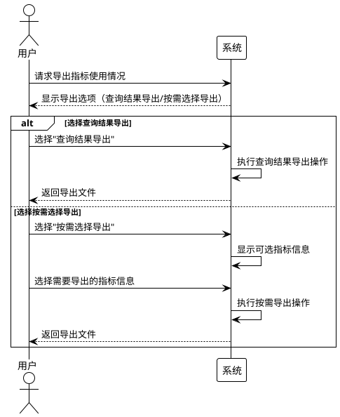

# 草稿

## 系统优化步骤。
### 1 前端优化，减少表单打开时的请求量。
- [x] 静态资源考虑使用专门的静态资源服务器部署。
- [x] 背景图片相关资源进行压缩。
- [x] 懒加载表单，减少crossui请求，从表单越多，减少的请求越多。
- [x] 懒加载地图组件js。减少近400个请求，包括js和css。
- [x]  架构升级，vue-cli版本升级。
### 2 索引优化。
- [x]  BZ_开头的表。
- [x]  APP_表。
- [x]  业务Entity表。
- [x]  产品表索引
- [x]  PCC_开头表。
- [x]  其他模型相关表。
- [x]  DASC安全表索引，USER，ROLE，ACE等表。
- [x]  Activiti 流程信息表索引。
### 3 服务器层面，增加两台应用服务器，使用NGINX代理，启用权重方式，使用更符合现状的负载策略。
- [x]  最小连接数+被动监测，超时记录错误，达到错误上线数时，临时下线错误节点。
	- 请求超过2分钟判断为错误，错误数+1
	- 错误数达到5次时将错误节点临时下线1天。
### 4 应用层面
- [x]  数据字典优化，前端统一获取字典请求。
- [x]  材料加载优化。
- [x] 保存优化。
- [x] 报盘导入优化：界址点部分内容，从数据包保存修改为原生JDBC批量插入。
	- 对于1万5个界址点项目，导入从50s优化到6s
- [x]  SQL相关内容优化。
	- 子查询拆分。
	- 关联字段索引添加。
	- 关联逻辑优化。
	- 数据查询到数字的sql修改，去除非必要的表。
		- 批准预警查询优化。
		- 批复箱子查询优化。

SQL优化记录

| SQL                                                | 优化前         | 优化后   | 备注          |
| -------------------------------------------------- | ----------- | ----- | ----------- |
| dynamicsql/useingRegulate.xml getApproveBoxEnd     | 2.2s        | 150ms | 办结箱         |
| dynamicsql\useingRegulate.xml getEndApprove_Detail | 1.1s        | 50ms  | 办结箱详情       |
| uf_getboxendcount                                  | 2s          | 150ms | 办结箱数量查询     |
| getAcceptBox                                       | 5s          | 500ms | 接件箱         |
| getUseSPApprove_Detail                             | 600ms-1s    | 100ms | 待办箱子审批箱详情   |
| uf_getboxtodocount                                 | 600ms-900ms | 150ms | 待办箱子数量查询    |
|                                                    | 600ms-900ms | 150ms | 收件箱数量查询     |
| uf_getboxdonecount                                 | 1s          | 800ms | 已办箱数量查询     |
| getApproveBoxDone_sp                               | 1.5s        | 1s    | 已办箱（待进一步优化） |
| getKyPayment                                       | 5s          |       | 矿压协议箱       |
| getQueryBox_DetailSimple                           | 1s          | 400ms | 查询统计子查询优化   |
| getBoxAdminQueryStatistics_Detail                  | 3s          | 50ms  | 运维箱详情优化     |
|                                                    |             |       |             |


这个问题如何评估回答： 
2． 技术支撑与平台能力（底座稳不稳）。评估现有政务云及数据平台在并发、存储及安全方面对大规模运营的支撑能力，诊断"数据孤岛"成因。明确技术升级方向，涵盖算力扩容、API 适配、智能治理工具、隐私计算、区块链溯源及安全防护体系构建。

现有底座能力评估
- 安全防护体系：采用数慧DASC安全中心，实现资产统一纳管、威胁实时感知与自动化响应编排，覆盖数据分级分类、加密脱敏及合规审计，已满足等保3.0/密评基线要求。
- 流程与API治理：依托DAP构建平台实现跨部门业务流程的统一配置与低代码编排，通过标准化API网关与服务目录打通异构系统调用链路，初步化解“接口不通、流程断点”导致的协同瓶颈。
- 空间数据服务：基于ArcGIS架构的DMAP产品提供标准化GIS服务引擎，支持点位数据与图层资源的动态配置、发布与多源融合，支撑政务空间数据的高并发调用与可视化运营。

并发、存储及安全方面对大规模运营的支撑能力：
并发方面，因服务器资源限制，图形CPU计算资源不足。对于大规模运营的支撑能力需要从硬件资源方面进行扩容，通过负载均衡多节点实现大规模运营。
存储资源目前能够支撑现有平台运行，系统占用月增长量在可控范围。

数据孤岛根因诊断：
技术层：API适配与数据映射成本高，外部对接多管理方式原始；

技术升级与演进方向
面向大规模运营场景，应用渐进升级方向：
- 算力扩容：通过微服务化应用和采用弹性云资源调度，支撑突发政务高并发；
- API适配：完善DAP平台服务全生命周期管理，提升接口复用率与调用成功率；
- 安全升级：现有应用等保三级升级，保障应用安全。

```plantuml
Bob -> Alice : hello
Alice -> Wonderland: hello
Wonderland -> next: hello
next -> Last: hello
Last -> next: hello
next -> Wonderland : hello
Wonderland -> Alice : hello
Alice -> Bob: hello
```

